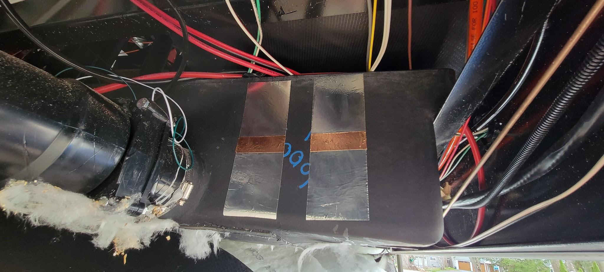
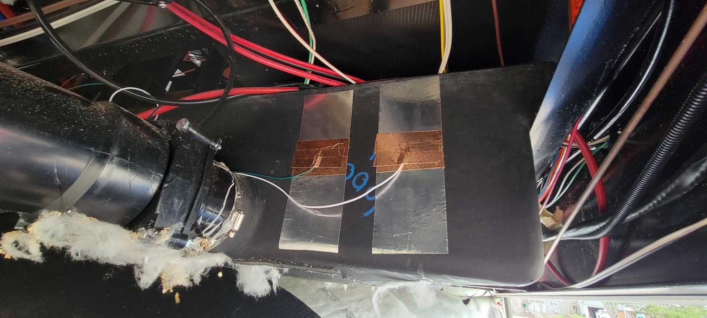
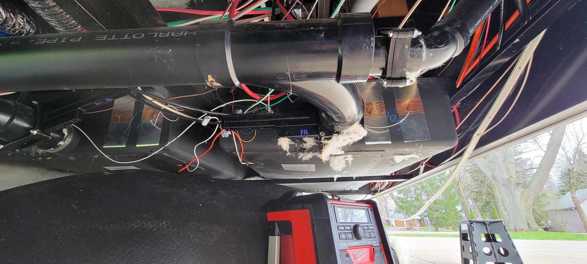
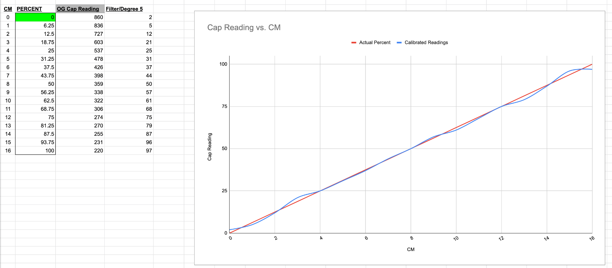

# Capacitance Liquid Level Sensor

The goal of this project is to determine the level of a liquid inside of
a tank without making direct contact with that liquid. While the intent
of this project is aimed at improving the monitoring of RV holding tanks
with the use of HomeAssistant, this type of liquid level measurement can
also be used in a variety of other applications.

#How does it work?

This project uses the concept of electromagnetic fringe fields and
capacitance to determine the current level of a liquid inside of a tank
without making direct contact. Liquid is an electrical conductor. When
two conductive materials are placed side-by-side, a "fringe" effect is
created. As the level of the liquid increases, the "fringe" decreases.
Therefore, metal tanks or tanks with metal cages will not work. It is
recommended that you use plastic or fiberglass tanks ¼" thick or less.

**[Materials Needed]**

-   NodeMCU ESP32 or ESP8266

-   Breadboard Jumper Wires

-   2-Inch Aluminum HVAC Tape

-   1-Inch Copper Adhesive Tape

-   Plastic or fiberglass tank

-   Secondary Container with a known liquid quantity (such as a 1 gallon jug)

-   *Sewer connection during tank calibration is highly recommended*

**Instructions**

Each setup is based on the tank, the type of liquid being measured, and
the amount of additional noise picked up by the ESP device. Results may
vary.

1.  Determine the size of your holding tank in gallons. This will be needed later on.

2.  Setup the ESP32 by placing a jumper wire on P12 (or whichever pin is
    equivalent to Touch 4), and another one on a GND. A single ESP32
    can monitor as many tanks as there are Touch GPIOs available. The
    ESP32 will need to be powered via 5v to ensure adequate
    capacitance values.\
    ***IMPORTANT: The use of GPIOs 0, 2, 4, 5, 12, and 15 will result
    in a "strapping pin" error during setup. Avoid these pins if
    possible.*

**TANK SETUP**

3.  Cut 2 identical strips of aluminum tape so that they reach from the
    bottom to the top of your tank.. Clean the side of the tank and
    apply the pieces of tape 1-½\" to 2\" apart. *Based on your
    readings in future steps, the distance between the strips can be
    adjusted to facilitate better capacitance readings if
    needed.
    
    

4.  Cut four 2-inch strips of copper tape and place them in the center
    of the strip, forming a roughly 2"x2" square with a slight
    overlap. Where the pieces overlap, place one of the GPIO jumper
    wires and secure. Ensure there is good contact with the copper
    tape.
    
    
    
    *Additional copper strips may be needed to secure the wire.
    
    

5.  Open HomeAssistant, navigate to ESPHome, and follow the directions
    to setup your ESP32. Once initial setup is complete, copy the code
    found above and paste it below "captive_portal". Make adjustments
    to correlate with your specific device as needed.

    This code creates 2 sensors in HomeAssistant. The first is the
    straight capacitance value taken from the log which is needed for
    setup and can be used for debugging later on. The second sensor maps
    the capacitance values to the desired percentage values which will be
    gathered in the next step. An example yaml dashboard is provided.

*Please note this example dashboard uses the [[ApexCharts]{.ul}](https://github.com/RomRider/apexcharts-card) card.*

**TANK CALIBRATION**

*Before proceeding, the tanks involved will need to be emptied. It is recommended that you flush your black tank if able to do so in order to get the most accurate baseline readings.*

6.  For each tank you choose to monitor, calibration is required.
    Calibration requires a container with a known volume (1 gallon
    milk jug, 5 gallon bucket, etc). To calibrate your Sensor, start
    with your tank empty and record the capacitance value. Then, fill
    the tank with your container and record each value (for example, a
    50 gallon tank being filled with a 1 gallon milk jug will have 50
    values.) Remember, the more data points you have here, the more
    accurate your sensor will be.
    
    You will need to convert gallons into percent so you can properly
    map the values. For example, a 50 gallon tank is 50% full with 25
    gallons. It is approximately 25% full with 12.5 gallons.\
    This is an example of how I recorded my data. The graph is not
    needed.
     height="2.3766272965879267in"}

7.  With the capacitance values recorded, open ESPHome and edit the
    code, adding in your capacitance values and their corresponding
    percentage under "datapoints:\". Update your ESP32 and test your
    current calibration. If values appear incorrect, repeat step 7 and
    adjust datapoints accordingly.

    Datapoints should be in the following format:

    - Capacity Reading -> Mapped Percent
    - 426 -> 37

8.  Once a good accuracy is achieved, change the sensor update rate in
    ESPHome from 3 seconds to your preferred rate, such as 15 minutes.

That's it! You should now have a working non-contact liquid level
sensor that can be used throughout your HomeAssistance instance.

Special thanks to all of those who assisted in any aspect of this
project.
